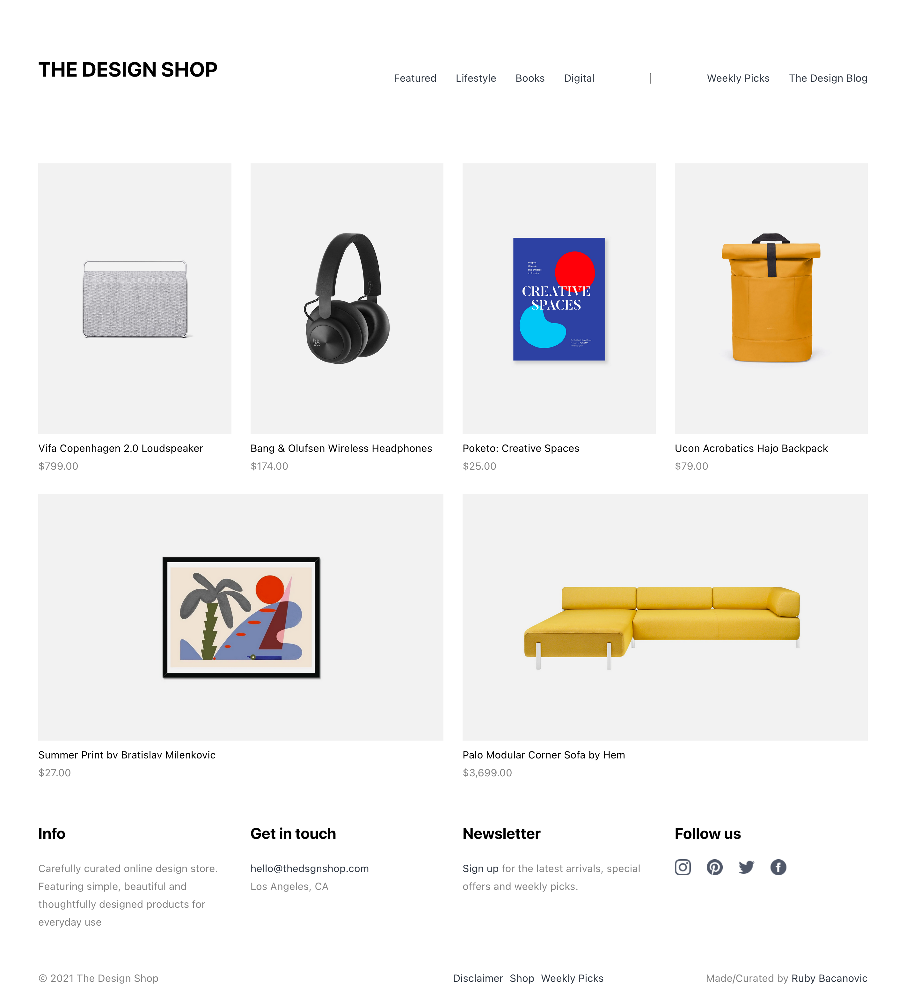

# design-shop-react-props | Design Shop Website

This project is build with React and uses props to learn how to use components in an efficient way.

## Table of contents

- [Overview](#overview)
  - [The challenge](#the-challenge)
  - [Screenshot](#screenshot)
  - [Links](#links)
- [My process](#my-process)
  - [Built with](#built-with)
- [Author](#author)
- [Acknowledgments](#acknowledgments)

## Overview

### The challenge

The challenge was to create a product component that outputs the product cards.
The price, name and image of the product are passed via props (img, product, price, description).

Code a component that renders three product cards. Give each card its own props.

### Screenshot

### Links

- Solution URL: [https://github.com/jenniferhubermayer/xxx](https://github.com/jenniferhubermayer/xxx)
<!-- - Live Site URL: [https://jenniferhubermayer.github.io/sneaker-shop/](https://jenniferhubermayer.github.io/sneaker-shop/) -->

## My process

### Built with

- React App
- Semantic HTML5 markup
- CSS
- Flex and Grid
- JavaScript

## Author

- Website - [https://github.com/jenniferhubermayer](https://github.com/jenniferhubermayer)

## Acknowledgments

This project has been realized as part of the [super(c)ode](https://www.super-code.de/) "Front-End Boot-Camp 2022".
